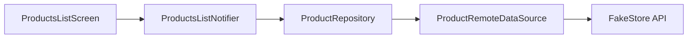

# Product Catalog

Display name: **Product Catalog** (see `lib/core/constants/app_constants.dart`).

A Flutter product catalog app built for the **Kodevio technical assessment**. It loads products from the [FakeStore API](https://fakestoreapi.com), supports infinite scroll pagination, local search, favorites, pull-to-refresh, and light/dark theme — with **feature-based Clean Architecture**, **MVVM-style presentation**, and **Riverpod** for dependency injection and state.

---

## Features

| Feature | Description |
|---------|-------------|
| Product listing | Paginated grid/list with loading, empty, and error states |
| Infinite scroll | Loads more items via `limit` / `offset` (10 per page) |
| Product details | Title, price, image, category, rating, description |
| Pull-to-refresh | Refreshes the current list from the API |
| Local search | Filters loaded products by title (client-side) |
| Favorites | Toggle favorites; persisted with `SharedPreferences` |
| Favorites filter | AppBar toggle to show only favorited products |
| Dark / light theme | Toggle in AppBar; preference persisted locally |
| Responsive UI | 1 / 2 / 3 columns by screen width (phone / tablet / desktop) |

---

## Tech stack

| Layer | Choice |
|-------|--------|
| Framework | Flutter (SDK ^3.10.3) |
| State management | Riverpod 2 + `StateNotifier` / `StateNotifierProvider` |
| Architecture | Feature-based Clean Architecture (domain → data → presentation) |
| Networking | `http` |
| Images | `cached_network_image` |
| Local storage | `shared_preferences` |

### Dependencies

| Package | Purpose |
|---------|---------|
| `flutter_riverpod` | Provider scope, DI, `StateProvider`, `Provider` |
| `state_notifier` | `StateNotifier` base class for feature state |
| `http` | REST calls to FakeStore API |
| `cached_network_image` | Cached product images with placeholders |
| `shared_preferences` | Favorite IDs and theme mode persistence |

---

## Getting started

### Prerequisites

- Flutter SDK (3.10+)
- Android Studio / VS Code with Flutter extensions, or Cursor
- An emulator, physical device, or desktop target

### Install and run

```bash
git clone <your-repo-url>
cd product-catalog-clean-architecture
flutter pub get
flutter run
```

### Quality checks

```bash
flutter analyze
flutter test
```

### Release APK (Android)

```bash
flutter build apk --release
```

Output: `build/app/outputs/flutter-apk/app-release.apk`

---

## Architecture

The codebase is organized **by feature**, not by technical layer at the root. Each feature owns its `domain`, `data`, and `presentation` folders. Shared code lives under `lib/core/`.

```
lib/
├── main.dart                 # SharedPreferences init + ProviderScope
├── app.dart                  # MaterialApp, theme binding
├── core/
│   ├── constants/            # API URLs, strings, storage keys
│   ├── error/                # Failures, exceptions, Result<T>
│   ├── network/              # http.Client provider
│   ├── storage/              # SharedPreferences provider
│   ├── theme/                # AppTheme, spacing
│   ├── utils/                # Price format, responsive helpers
│   ├── widgets/              # Loading, error, empty views
│   └── routing/              # Navigation helpers
└── features/
    ├── products/
    │   ├── domain/           # Product, PaginatedProducts, repos, use cases
    │   ├── data/             # ProductModel, remote DS, repository impl
    │   └── presentation/     # Screens, widgets, StateNotifiers
    ├── favorites/
    │   ├── domain/
    │   ├── data/
    │   └── presentation/
    └── theme/
        └── presentation/     # ThemeMode StateNotifier + toggle widget
```

### Data flow (products list)



1. **Presentation** — `ProductsListScreen` watches `productsListProvider` and calls `load()` / `refresh()`.
2. **Domain** — `ProductRepository` defines contracts; use cases wrap single operations where useful.
3. **Data** — `ProductRepositoryImpl` maps DTOs to entities and exceptions to `Failure`.
4. **Core** — `Result<T>` (`Success` / `ErrorResult`) keeps error handling explicit without throwing into the UI.

### Dependency rule

- **Domain** does not import Flutter or data layer.
- **Data** implements domain repositories; depends on domain entities and core errors.
- **Presentation** depends on domain (and Riverpod providers); never imports data implementations directly except via providers.

---

## State management

Riverpod is used in two roles:

1. **Dependency injection** — `Provider` for repositories, data sources, use cases, `http.Client`, `SharedPreferences`.
2. **UI state** — `StateNotifierProvider` + dedicated **State classes**.

| Provider | State type | Responsibility |
|----------|------------|----------------|
| `productsListProvider` | `ProductsListState` | Paginated products, loading flags, errors |
| `favoritesProvider` | `FavoritesState` | Favorite product IDs |
| `themeModeProvider` | `ThemeMode` | Light / dark mode |
| `productSearchQueryProvider` | `String` | Search field text |
| `showFavoritesOnlyProvider` | `bool` | Favorites-only filter |

`ProductsListState` fields: `products`, `isLoading`, `isLoadingMore`, `hasMore`, `failure`.

Pagination is disabled while **searching** or **favorites-only filter** is active; filters apply only to products already loaded.

---

## API

Base URL: `https://fakestoreapi.com`

| Endpoint                          | Usage |
|-----------------------------------|--------|
| `GET /products?limit=20&offset=0` | Paginated product list |
| `GET /products/{id}`              | Single product (available; detail screen uses navigation args) |

`hasMore` is derived when the returned page length is `>= limit`.

---

## Testing

Tests follow the same feature layout:

```
test/
├── helpers/                  # Test app wrapper, fake repositories
├── core/
└── features/
    ├── products/             # data, domain, presentation tests
    ├── favorites/
    └── theme/
```

```bash
flutter test
```

Coverage includes repository mapping, remote data source parsing, use cases, `StateNotifier` behavior, and widget tests for list, search, favorites, theme, and navigation.

---

## Project conventions

- **Entities** are immutable; `Product` equality is by `id`.
- **Failures** are typed (`NetworkFailure`, `ServerFailure`, etc.) and surfaced in UI with retry.
- **Screens** stay thin; business rules sit in notifiers, use cases, or repositories.
- **Widgets** under `core/widgets` are shared; feature-specific widgets stay in the feature folder.

---

## Development history

| Sprint | Deliverable |
|--------|-------------|
| 0 | Baseline Flutter shell |
| 1 | Riverpod, theme, folder structure |
| 2 | Domain layer (entities, repositories, use cases) |
| 3 | Data layer (models, remote DS, repository impl) |
| 4 | Riverpod DI wiring |
| 5 | Products list (loading / error / empty, cached images) |
| 6 | Product detail + navigation |
| 7 | Pull-to-refresh |
| 8 | Local search by title |
| 9 | Favorites persistence + UI |
| 10 | UI polish + responsive layout |
| 11 | Infinite pagination + feature-based refactor + this README |
| 12 | Dark / light theme with persistence |

---

## License

Assessment project — use and submission per Kodevio / employer instructions.
